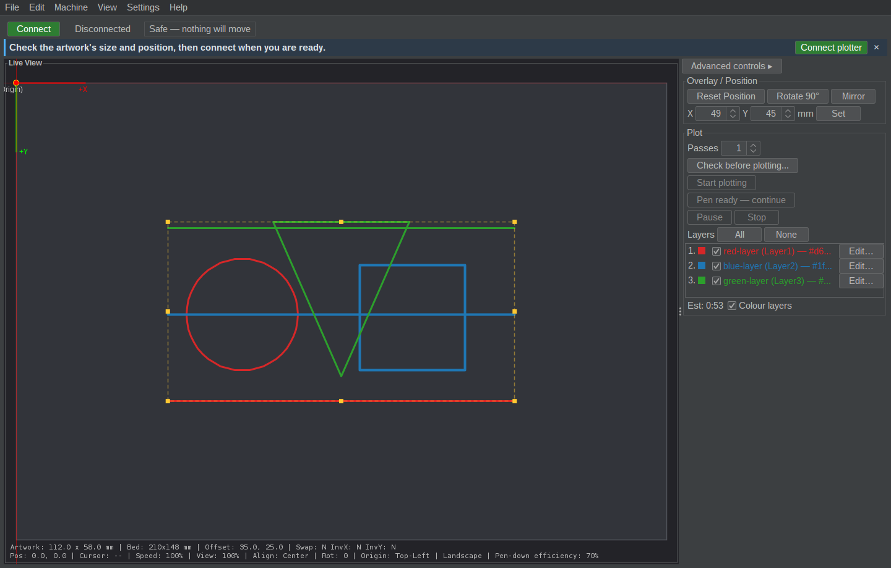
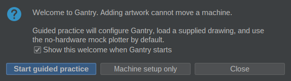
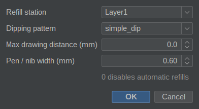
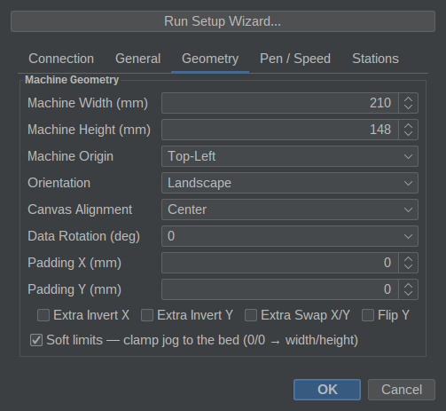

# Application screenshots

Refreshed 2026-09-26 from the `1.0.0-rc.2` GUI JAR, including the [GUI usability fixes](../test-results-2026-09-26-gui.md),
on Ubuntu 24.04 with Java 17, FlatLaf dark theme and UI scale 1.

These are captures of the running application's Swing root panes, rendered by
Swing itself because desktop screen capture returned black pixels. Native window
borders are excluded. No AI-generated interface or artwork is used. The harness
uses an isolated mock profile, loads the committed gallery SVG through the real
importer, and opens the real dialogs. No plotter was connected.

## Workspace and layer preview

The [multi-colour sample](../samples/multi-colour-layers.svg), with its three
layers selected, in a 210 × 148 mm workspace. The control panel uses its default width; long layer names retain their full text
in tooltips. Nib widths are 0.6, 0.8 and 0.6 mm.



## Welcome



## Per-layer watercolor settings



## Machine geometry



## Reproduce

From the repository root on Linux with a JDK and an available graphical display
(or Xvfb), build the release JAR and run:

```bash
./scripts/capture-screenshots.sh dist/1.0.0-rc.2/Gantry-1.0.0-rc.2.jar
```

The script compiles the developer-only capture harness, creates a temporary
profile and replaces these four PNGs. It cleans up the temporary profile on exit.
Inspect the images before committing them. Private UI entry points are used to
prepare repeatable views; this is a documentation tool, not a GUI acceptance test.
